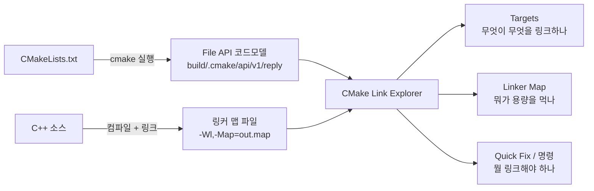
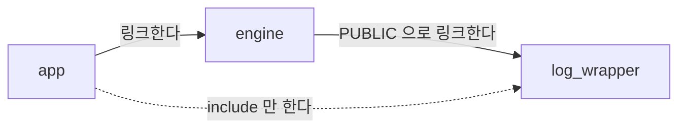
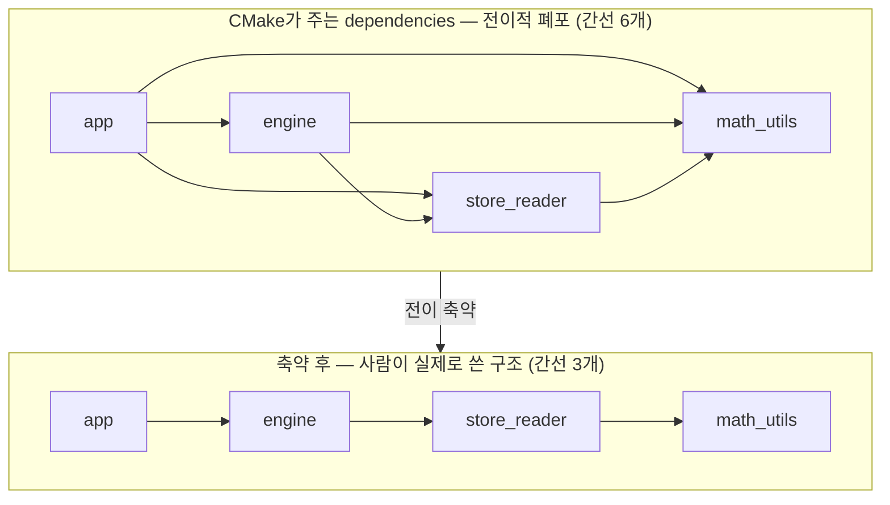
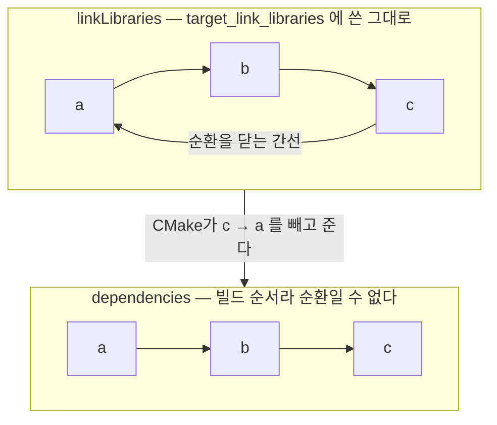

[English](https://github.com/Ruminem/cmake-link-explorer/blob/main/README.md) · **한국어**

# CMake Link Explorer

CMake 프로젝트에서 링크 때문에 막히는 순간을 없애는 VS Code 익스텐션.

| 기능 | 답하는 질문 | 언제 쓰나 |
|---|---|---|
| **[Link for include](#link-for-include)** | 이 헤더 쓰려면 **뭘 링크해야 하나** | `#include` 쓰고 막혔을 때 |
| **[Targets](#targets)** | 무엇이 무엇을 링크하나, 특히 **누가 이걸 링크하나** | 구조 파악, 영향 범위 |
| **[Linker Map](#linker-map)** | **뭐가 용량을 먹나**, 지난 빌드 대비 뭐가 늘었나 | 바이너리가 커졌을 때 |
| **[Compiled With](#what-is-this-file-compiled-with)** | 이 파일의 **실효 매크로와 include 경로** | `#ifdef`가 안 잡힐 때 |
| **[Cycles / Unused](#find-cycles-and-unused-targets)** | **순환 링크와 아무도 안 쓰는 라이브러리** | 구조 정리할 때 |
| **[Compare Trees](#compare-with-another-build-tree)** | 두 빌드 트리가 **어디서 갈라지나** | 여기선 되는데 저기선 깨질 때 |

## 어디서 답을 가져오나

**`CMakeLists.txt`를 파싱하지 않음.** CMake와 링커가 이미 만들어 둔 결과물을 읽음.
그래서 제너레이터 표현식이든 조건부 링크든 헬퍼 함수든, 해석은 이미 끝난 상태로 옴.



코드모델에는 타겟·의존성·매크로·include 경로와 **각 항목이 쓰여진 `파일:줄`**까지
들어 있음. 맵 파일에는 무엇이 몇 바이트를 차지하는지가 들어 있음. 두 쪽을 이어 붙이는
것이 이 익스텐션이 하는 일임.

# 설치

빌드도 의존성도 없음. 순수 JavaScript임.

## Windows, 더블클릭

[Releases](https://github.com/Ruminem/cmake-link-explorer/releases)에서
`cmake-link-explorer-<version>-windows.zip`을 받아 풀고 `install.cmd`를 실행함.
VS Code를 직접 찾아 설치하므로 **`code`가 PATH에 없어도 됨** — 방금 VS Code를 깔았다면
터미널이 아직 옛 PATH를 들고 있어서 `code`가 없는 경우가 흔함.

## VSIX로 설치

[Releases](https://github.com/Ruminem/cmake-link-explorer/releases)에서 `.vsix`를 받아
확장 탭의 `...` → **VSIX에서 설치**를 누르거나, 명령줄로:

```
code --install-extension cmake-link-explorer-<version>.vsix
```

직접 만들려면 저장소에서 (Node가 필요하고, 확장 자체는 여전히 의존성이 없음):

```
npx @vscode/vsce package
```

## 클론해서 링크 걸기

고쳐가며 쓸 거면 이쪽이 편함. `git pull` 하고 VS Code만 다시 켜면 반영됨.

**macOS / Linux**

```
git clone https://github.com/Ruminem/cmake-link-explorer.git ~/cmake-link-explorer
mkdir -p ~/.vscode/extensions
ln -s ~/cmake-link-explorer ~/.vscode/extensions/cmake-link-explorer
```

**Windows** — 심볼릭 링크는 권한이 필요할 수 있어 정션(`/J`)을 씀.

```
git clone https://github.com/Ruminem/cmake-link-explorer.git C:\dev\cmake-link-explorer
mkdir "%USERPROFILE%\.vscode\extensions"
mklink /J "%USERPROFILE%\.vscode\extensions\cmake-link-explorer" "C:\dev\cmake-link-explorer"
```

## 확인

VS Code를 **완전히 종료했다가** 다시 켬.

```
code --list-extensions | grep cmake-link          # macOS / Linux
code --list-extensions | Select-String cmake-link # Windows PowerShell
```

`Ruminem.cmake-link-explorer` 가 뜨면 설치된 것임. 테마나 아이콘 확장을 깐 것과
같은 상태이고, **클론한 폴더를 VS Code로 열어둘 필요는 없음.**

그다음부터는 CMake 프로젝트를 열거나 C/C++ 파일을 여는 것만으로 켜짐.
아이콘을 누를 필요도 없음.

빌드 디렉토리는 `CMakeCache.txt`를 찾아 자동 탐지함(3단계 깊이까지).
맵 파일도 빌드 디렉토리에서 `*.map`을 찾아 목록으로 띄움.

## 익스텐션 자체를 고칠 때만: F5

이 저장소를 VS Code로 열고 `F5`를 누르면 익스텐션이 로드된 새 창이 뜸.
코드를 고쳐가며 확인할 때만 쓰는 개발 모드이고, 그냥 쓰기만 할 거면 필요 없음.

---

# Link for include

가장 자주 막히는 지점임.

> "이 헤더를 include해서 안에 있는 API를 쓰려는데,
>  CMakeLists.txt에 뭘 어떻게 링크해야 하는지 모르겠음."

`#include` 줄에 커서를 두면 **전구(Quick Fix)** 가 뜸.

```cpp
#include "log_wrapper.h"     💡 Link log_wrapper from store_test
```

누르면 알맞은 `CMakeLists.txt`를 찾아 고침.

```cmake
target_link_libraries(store_test PRIVATE store_reader log_wrapper)
                                                      ^^^^^^^^^^^ 추가됨
```

기존 `target_link_libraries` 호출이 있으면 거기에 붙이고, 없으면
`add_library`/`add_executable` 바로 다음에 새로 만듦. 같은 파일의 다른
타겟은 건드리지 않음.

**단, 붙이는 게 맞을 때만 붙임.** `if(WIN32)` 안에 있는 호출에 붙이면 윈도우에서만
링크되고, `INTERFACE` 키워드 뒤에 붙으면 그 타겟 자신은 아예 링크하지 않음 — 둘 다
겉보기엔 고쳐진 것처럼 보임. 그래서 호출이 블록 안에 있거나 마지막 섹션의 키워드가
필요한 것과 다르면, 붙이지 않고 **별도 호출을 새로 씀.** 알림이 그 이유를 같이
알려줌. 기존 호출이 키워드 없는 옛 형식이면 CMake가 두 형식을 섞는 걸 거부하므로,
configure도 안 될 편집을 보여주는 대신 손으로 넣으라고 함.

**키워드는 어디서 include 했느냐로 정해짐.**

| include 위치 | 키워드 | 이유 |
|---|---|---|
| `.cpp` | `PRIVATE` | 남이 볼 일 없음 |
| `.h` / `.hpp` | `PUBLIC` | 이 타겟의 인터페이스가 됨. 소비자도 그 헤더를 보므로 의존성이 같이 따라가야 함 |
| INTERFACE 라이브러리 | `INTERFACE` | 다른 선택지가 없음 |

헤더에서 include했는데 `PRIVATE`로 걸면 **여기선 컴파일되고 소비자 쪽에서
깨짐.** 같은 헤더라도 `.cpp`에서 부르면 `PRIVATE`, `.h`에서 부르면 `PUBLIC`.

## 네 가지 판정

| 상태 | 뜻 |
|---|---|
| **already-linked** | 직접 링크돼 있음. 그냥 쓰면 됨 |
| **transitive** | 다른 라이브러리를 거쳐서만 닿음. **오늘은 컴파일되지만** 중간 라이브러리가 그걸 안 쓰게 되는 날 깨짐 |
| **needs-link** | 링크가 없음. 추가할 줄을 그대로 만들어줌 |
| **not-found** | 이 프로젝트의 어떤 타겟도 제공하지 않음 |

`transitive`를 따로 구분하는 게 핵심임. 빌드가 되니까 아무도 눈치 못 채다가
나중에 남의 커밋 때문에 깨지는 종류의 문제라서.



`app`은 `log_wrapper`를 직접 링크하지 않음. `engine`이 `PUBLIC`으로 끌고 오는
덕에 오늘은 컴파일됨. **누군가 `engine`에서 `log_wrapper` 링크를 떼는 날, `app`이
깨짐.** 고친 사람은 자기가 뭘 깼는지 모르고, 깨진 쪽은 왜 깨졌는지 모름.

점선을 실선으로 만들라는 것이 `transitive` 판정임.

## 어떻게 찾나

헤더 → 타겟은 세 단계로 찾고, 신뢰도 순으로 보여줌.

1. **listed** — 타겟의 소스 목록에 그 헤더가 있음 (CMake가 아는 것, 확실)
2. **owned** — 헤더가 그 타겟의 소스 디렉토리 안에 있음
3. **nearby** — 그 이름의 파일이 타겟 디렉토리 아래 어딘가에 있음

파일이 속한 타겟은 CMake의 소스 목록에서 역으로 찾음.

**한계 —** 헤더 전용 INTERFACE 라이브러리는 CMake 코드모델에 타겟으로 나오지
않아서 찾을 수 없음. abseil의 `absl::config` 같은 것들이 여기 해당함.
그럴 땐 `not-found`라고 정직하게 말함.

---

# What Is This File Compiled With?

> "`#ifdef USE_HAL_DRIVER`가 왜 안 잡히지?"
> "이 파일이 도대체 어느 include 경로를 보고 있지?"

소스 파일을 열고 명령을 부르면 **실효 매크로와 include 경로**가 나옴.

```
board.cpp
  target     board  [static]
  language   CXX (17)

  defines (4)   set by the build; #define in the source is not part of this
    BOARD_REV=3
    STM32F407xx
    USE_HAL_DRIVER
    NDEBUG   [from compile flags]

  include paths (2)
    /proj/board/inc
    /opt/sdk   [system]
```

**CMakeLists를 읽어서는 알 수 없는 답임.** 위 예에서 `BOARD_REV=3`만 `board`가
직접 정의한 것이고, `STM32F407xx`와 `USE_HAL_DRIVER`는 `hal`이 `PUBLIC`으로 붙여
전파된 것임. CMake가 제너레이터 표현식과 `PUBLIC`/`INTERFACE` 상속을 전부 해석한
뒤에 코드모델을 쓰므로, 여기 나오는 게 컴파일러가 실제로 받는 값임.

**`target_compile_definitions`만 세는 게 아님.** `CMAKE_CXX_FLAGS`나
`target_compile_options()`에 넣은 매크로도 컴파일러에는 똑같이 도달하는데, CMake는
그걸 define이 아니라 그냥 명령줄 조각으로 적음. 그래서 거기서도 읽어내고
`[from compile flags]`로 표시함. MSVC의 `/D`도 읽음.

**소스에 쓴 `#define`은 이 목록에 없고, 있을 수도 없음.** CMake는 파일 내용을
읽지 않음. 컴파일러에 넘길 명령줄만 알 뿐임. 파일에 직접 쓴 매크로나 헤더에서
딸려온 매크로는 빌드 시스템이 볼 수 있는 층위보다 한 단계 아래에 있음.

**헤더는 컴파일되지 않아 어느 그룹에도 속하지 않음.** 타겟에 언어 그룹이 하나뿐이면
그걸 보여주되 추론이라고 표시하고, C와 C++가 섞인 타겟이면 **고르지 않음.**
둘 중 하나를 찍으면 답을 지어내는 셈이라서.

---

# Targets

```
TARGETS                            실행 파일이 먼저, 그다음 의존받는 순
🚀 sample_app     →3
📦 engine         →2 ←2            펼치지 않아도 허브라는 게 보임
📦 math_utils        ←2            아무것도 링크 안 하는 말단
📦 db_wrap           ←1

▾ 📦 engine       →2 ←2
     → math_utils      static      파랑 화살표 = 얘가 링크하는 것
     → store_reader    static  →1
     ← engine_test     exe         주황 화살표 = 얘를 링크하는 것
     ← sample_app      exe
```

행 하나에 양방향 개수가 다 들어 있음.

- `→`만 있음 = **최상위**, 아무도 안 씀 (보통 실행 파일)
- `←`만 있음 = **말단 라이브러리**, 깨지면 위험한 것
- 둘 다 큼 = **중간 허브**

펼치면 양방향이 한 번에 나옴. 폴더를 거치지 않으므로 클릭 한 번이면 됨.
자식을 계속 펼치면 그 방향으로만 체인을 따라감.

### 맵을 열면 크기가 붙음

Linker Map 탭에서 맵 파일을 열면, 같은 행에 **그 타겟이 바이너리에서 차지하는
크기**가 함께 나옴.

```
🚀 sample_app     →3        111 B
📦 engine         →2 ←2      44 B
📦 store_reader   →1 ←2     1.0 KB
📦 db_wrap           ←1      277 B
📦 log_wrapper       ←1       49 B
📦 math_utils        ←2               이 이미지에 없음
📚 render_core    →1 ←1     dynamic
```

CMake가 알려주는 `nameOnDisk`(`libstore_reader.a`)를 맵 파일의 이름과 맞춤.
실행 파일은 CMake가 오브젝트를 `<타겟>.dir/`에 넣는 규칙으로 찾음.

그래서 두 질문을 한 줄에서 같이 볼 수 있음.

- `store_reader` — **2개만 쓰는데 1.0 KB**. 정리 후보
- `math_utils` — **2개가 쓰는데 이미지에 없음.** `render_core`가 셰어드 라이브러리라
  거기서 심볼이 해결된 것. 이런 건 맵을 직접 읽지 않으면 모름
- `render_core` — 동적 링크라 이미지에 없음. 임포트 스텁 몇십 바이트를 크기로
  표시하면 자릿수가 틀리므로 `dynamic`이라고만 씀

`sortTargets`를 `size`로 두면 **"쓰는 곳은 적은데 무거운 것"**을 위에서부터
찾을 수 있음. 바이너리 다이어트할 때 제일 먼저 하는 일임.

## 어떻게 동작하나

CMakeLists.txt를 파싱하지 않음. CMake의 **File API**(3.14+)를 씀.

빌드 디렉토리에 쿼리 파일을 하나 만들어 두면, CMake가 다음 configure 때
`.cmake/api/v1/reply/`에 **완전히 해석된 타겟 그래프를 JSON으로** 써줌.
제너레이터 표현식이나 조건부 링크를 직접 해석할 필요가 없음.

### 응답은 스냅샷임

이 응답은 **CMake가 configure할 때** 쓰이고, `CMakeLists.txt`를 고쳐도 다시
쓰이지 않음. `target_link_libraries()` 줄을 지워도 *Which Library Provides This
Include?* 는 여전히 "이미 링크돼 있음"이라고 답함. 마지막 configure 기준으로는
맞고 눈앞의 파일 기준으로는 틀린 답인데, **맞는 답과 생김새가 똑같음.**

그래서 모든 명령이 응답을 그 응답을 만든 `CMakeLists.txt`들과 대조하고, 답하기
전에 먼저 알려줌:

> `example/CMakeLists.txt` changed since CMake last configured, so the answer for
> this include describes the previous configure.
> **[Run CMake configure] [Show it anyway]**

상태 표시줄도 같은 경고를 달고, 툴팁이 고쳐진 파일 이름을 보여줌.

시각만 보면 아무것도 안 바꾸고 `Ctrl+S`만 눌러도 걸림. 그래서 응답과 파일이
일치할 때 내용을 기록해 두고, 더 최신인 파일은 그 기록과 **내용까지 달라야**
고친 것으로 침.

**저장 안 된** `CMakeLists.txt`도 대상임. CMake는 버퍼가 아니라 파일을 읽으니
이건 어떤 타임스탬프로도 안 잡힘. **Run CMake configure**가 그것들을 먼저
저장하고, 링크 편집도 디스크까지 씀. 안 그러면 바로 옆 버튼으로 돌린 configure가
방금 쓴 줄이 없는 상태로 재생성해버림.

상태 표시줄은 이걸 실시간으로 따라감. `CMakeLists.txt`를 고치거나 저장하거나
되돌리면 모델이 다시 읽히기를 기다리지 않고 바로 바뀜.

### 전이 축약 (transitive reduction)

File API의 `dependencies`는 **빌드 순서 기준 전이적 폐포**다. 실행 파일 하나가
결국 링크하게 되는 모든 라이브러리를 나열하기 때문에, 그대로 보여주면
`target_link_libraries`에 세 줄 적은 타겟이 50개를 링크하는 것처럼 보임.

그래서 도달성을 보존하는 **최소 간선 집합**으로 줄여서 보여줌.



간선 6개가 3개가 됐는데 **닿을 수 있는 관계는 그대로임.** `app`에서 `math_utils`로
가는 길은 여전히 있음. 실측 (abseil-cpp, 타겟 121개):

| | |
|---|---|
| CMake가 보고한 간선 | 1,405개 |
| 축약 후 | 134개 (**90% 감소**) |
| `log_flags` 타겟 | 50개 → 3개 |

**주의 —** 축약된 그래프는 "링크 구조의 최소 형태"지 "`target_link_libraries`에
적힌 목록"이 아님.

- A가 B와 C를 명시적으로 링크하는데 B도 C를 링크하면, `A → C` 간선은 숨음
- 헤더 전용 INTERFACE 라이브러리는 CMake 코드모델에 타겟으로 나오지 않으므로
  애초에 표시되지 않음 (abseil 같은 프로젝트에서 흔함)

전체를 보려면 `showTransitiveDependencies`를 켜면 됨. 툴팁에는 항상
`links: 3 (50 including transitive)` 형태로 양쪽 개수가 함께 나옴.

## 기능

- 행의 `→n ←n` — 펼치지 않고도 보이는 양방향 개수
- 정렬은 기본이 **구조순** (실행 파일 → 의존받는 개수순). `sortTargets`로 알파벳순 전환
- `external` — 프로젝트 밖에서 오는 라이브러리 (하나로 묶어 맨 아래)
- 타겟 클릭 → 선언된 줄로 점프. 위치는 CMake의 `backtraceGraph`에서 읽음
- **Find Target** — 이름으로 찾기
- **Why Is This Linked?** — 두 타겟 사이 최단 의존 경로를 한 홉씩 추적.
  각 홉에 그 링크를 만든 `target_link_libraries`의 `파일:줄`이 붙음
- CMake 재구성 시 자동 갱신

### 점프는 텍스트 검색이 아님

타겟 위치를 `add_library(<이름>` 문자열로 찾으면, 이름이 변수이거나 호출이 헬퍼
함수 안에 있는 순간 못 찾음. 둘 다 실제 프로젝트에서 흔함.

```cmake
function(add_module name)
  add_library(${name} ${name}.cpp)     # 실제 add_library
endfunction()

add_module(sensor)                     # 사람이 쓴 줄
```

`sensor`를 텍스트로 찾으면 아무것도 안 나옴. CMake는 알고 있으므로
`backtraceGraph`에서 읽음. **사람이 쓴 줄로 커서를 옮기고**, 그 사이에 헬퍼가
끼어 있으면 실제 `add_library`가 어디서 돌았는지 상태 표시줄에 알려줌.
코드모델이 위치를 주지 않는 경우에만 예전 텍스트 검색으로 떨어짐.

---

# Find Cycles and Unused Targets

링크 그래프가 자기 자신에 대해 답할 수 있는 두 가짐.

```
cycles (1)
    a → b → c → a
      a links b    libs/a/CMakeLists.txt:6
      b links c    libs/b/CMakeLists.txt:4
      c links a    libs/c/CMakeLists.txt:5

unused libraries (1)
    legacy_parser  [static]    libs/legacy_parser/CMakeLists.txt:1
```

## 순환은 `dependencies`에 안 보임

CMake는 **정적 라이브러리끼리의 순환을 허용함.** 링크 줄에 아카이브를 반복해서
넣어 해결하므로 configure도 빌드도 통과함. 그래서 모르고 지나가기 쉬움.

문제는 File API의 `dependencies`가 **빌드 순서**라는 것임. 순서에 순환이 있을 수
없으니 CMake가 **순환을 닫는 간선을 빼고** 줌. `c`가 `a`를 링크해도
`c.dependencies`는 비어서 옴.



위만 보면 순환이 보이고, 아래만 보면 평범한 사슬로 보임.

그래서 이 검사는 `linkLibraries`(쓰여진 그대로의 링크 목록)를 읽음. 구형
코드모델에는 그 필드가 없는데, 그럴 땐 **"없음"이 아니라 "판단 불가"라고 말함.**
볼 수 없는 것을 없다고 하면 안 되니까. (간선이 아예 하나도 없는 프로젝트는 예외로,
그땐 순환이 있을 수 없으므로 "없음"이라고 답함.)

## 미사용 판정에서 빼는 것

아무도 안 링크한다고 다 군더더기는 아님.

| 제외 | 이유 |
|---|---|
| 실행 파일 | 진입점임. 아무도 안 링크하는 게 정상 |
| `install()`된 라이브러리 | 그게 배포물임. 외부에서 쓰라고 만든 것 |
| MODULE 라이브러리 | 플러그인이라 링크가 아니라 `dlopen`으로 씀 |
| UTILITY 타겟 | 애초에 링크 대상이 아님 |

---

# Compare With Another Build Tree

같은 `CMakeLists.txt`라도 플랫폼이 다르면 **configure 결과가 다름.** 평소 개발은
윈도우에서 하고 제품판은 리눅스에서 빌드한다면, "여기선 되는데 저기선 깨지는" 것의
정체는 대부분 이 차이임. 두 빌드 트리를 놓고 비교함.

```
this tree   C:/proj/out/build/x64-Debug
other tree  /mnt/linux/proj/build

only in this tree (1)
    win_shim  [static]    src/win/CMakeLists.txt:3

only in the other tree (1)
    posix_shim  [static]  src/posix/CMakeLists.txt:3

differing targets (1)
  "-" is only in this tree, "+" only in the other.

  core
    define    - USE_IOCP
    define    + USE_EPOLL
    include   - src/win
    include   + src/posix
    links     - win_shim
    links     + posix_shim
```

## 경로를 그대로 비교하면 전부 다름

같은 프로젝트라도 두 머신의 경로는 앞부분이 완전히 다름.
`C:/work/proj/src`와 `/home/me/proj/src`를 문자열로 견주면 **모든 include가 "다름"**
으로 나와서 신호가 파묻힘.

그래서 각 트리의 **자기 소스 루트 기준 상대 경로**로 바꿔서 맞춤. 위 둘은 똑같이
`src`가 됨. 구분자(`\` vs `/`)도 맞추고, 대소문자는 무시함 — 한쪽은 대개 윈도우이고
CMake가 체크아웃과 다른 대소문자를 기록할 수 있어서임.

## 일부러 비교하지 않는 것

| 제외 | 이유 |
|---|---|
| 프로젝트 밖 include 경로 | `C:/SDK/include`와 `/opt/sdk/include`는 SDK를 어디 깔았는지를 말할 뿐임 |
| 외부 라이브러리 | 같은 것이 한쪽에선 `ws2_32.lib`, 다른 쪽에선 `-lz`로 쓰임 |

둘 다 매 타겟마다 걸려서, 정작 봐야 할 차이를 덮어버림.

---

# Linker Map

```
LINKER MAP  democore.map          gnu-ld · 21.8 KB
├── memory regions
│   ├── FLASH        3.6 KB / 512.0 KB    0.71%
│   └── RAM         18.0 KB / 128.0 KB     14.1%
├── by object                              21.8 KB total
│   ├── store_reader.o  (libdemocore.a)   17.5 KB   80.2%
│   │   ├── .bss                          16.0 KB   91.5%
│   │   └── .text                          1.5 KB    8.4%
│   └── app.o                              2.4 KB   10.8%
├── by section
├── largest symbols
└── why archive members were pulled in
    └── math_utils.o        ← app.o  (math_project)
```

## 지원 포맷

| | 생성 방법 | 상태 |
|---|---|---|
| **GNU ld** | `-Wl,-Map=out.map` | 실제 `arm-none-eabi-ld` 출력으로 검증 |
| **Apple ld64** | `-Wl,-map,out.map` | 실제 Xcode 링커 출력으로 검증 |
| LLVM lld | `--Map=` | **미지원** |

lld는 일부러 넣지 않았음. 실물 샘플 없이 포맷을 추측해서 넣으면 조용히 틀린
숫자를 보여주게 됨. 샘플이 생기면 그때 추가함.

포맷은 파일 내용으로 자동 감지함. 맵 파일이 아니면 오해석하지 않고 거절함.

## GNU ld 파싱에서 신경 쓴 것

- **줄바꿈된 섹션 이름** — 이름이 길면 GNU ld가 주소/크기를 다음 줄로 넘김.
  `.text.engine_load` 같은 게 전부 여기 해당해서, 이걸 놓치면 실제 임베디드
  맵의 상당 부분이 통째로 누락됨
- **아카이브 멤버** — `libfoo.a(bar.o)`를 아카이브와 오브젝트로 분리
- **`Archive member included` 표** — 각 아카이브 멤버가 **왜** 들어왔는지
  (어떤 오브젝트가 어떤 심볼을 참조해서). Targets 탭의 "Why Is This Linked?"와
  같은 질문에 대한 링커 수준의 답임
- **`Discarded input sections`** — `--gc-sections`로 잘려나간 것들. 이미지 크기
  집계에서는 빼되 따로 보여줌
- **메모리 영역** — `Memory Configuration` 표를 읽어 FLASH/RAM 사용률을 계산.
  주소 기준으로 배치하므로 `AT>`로 LMA만 FLASH인 `.data`는 RAM 쪽에 잡힘
- **심볼 vs 링커 스크립트 대입** — `. = ALIGN(4)` 같은 줄은 심볼이 아님

## C++ 심볼 디맹글링

맵 파일의 심볼은 맹글링돼 있어서, 정작 이 기능이 제일 필요한 C++ 프로젝트에서
읽을 수가 없음. 심볼 전체를 `c++filt`에 한 번에 흘려보내 디맹글함.

```
__ZNSt3__111__introsortINS_17_ClassicAlgPolicyERNS_6__lessIvEE...
  ↓
std::__1::__introsort<std::__1::_ClassicAlgPolicy, ...>(...)
```

툴체인이 다르면 `demanglerCommand`를 바꾸면 됨 (`arm-none-eabi-c++filt` 등).

`c++filt`가 없으면 **내장 디맹글러**가 대신 받음. 윈도우에는 보통 `c++filt`가
없는데(Git for Windows도 번들하지 않음) 맵은 리눅스 빌드에서 나오므로, 그쪽에서는
이게 기본 경로임.

내장 쪽은 **읽을 가치가 있는 형태만** 다룸. 네임스페이스 함수, 멤버 함수,
생성자·소멸자, 연산자, 기본 타입과 포인터·레퍼런스, 백레퍼런스까지임.
템플릿과 ABI 태그는 **일부러 거절하고 원래 이름을 그대로 둠.**

```
__ZN11log_wrapper3LogEPKcS1_   →  log_wrapper::Log(char const*, char const*)
__ZN4TileaSERKS_               →  Tile::operator=(Tile const&)
__ZNKSt3__110unique_ptrINS_... →  (그대로)
```

거절이 손해가 아닌 이유는 커밋된 맵에서 세어보면 나옴. 맹글링 심볼 503개 중
489개가 libc++ 내부이고, 그건 풀어도 200자짜리 템플릿이라 아무도 안 읽음.
실제로 읽는 14개는 전부 위 부분집합 안에 있음. 나머지를 추측해서 조용히 틀린
이름을 보여주느니 맹글링된 채로 두는 게 나음 — lld 맵 포맷을 넣지 않은 것과
같은 이유임.

## Diff

**Compare Two Map Files**로 두 빌드를 비교함. 오브젝트별·섹션별로 무엇이
얼마나 늘고 줄었는지, 변화량 큰 순으로 정렬해서 보여줌. 안 바뀐 항목은 뺌.

```
DIFF
├── total          44.1 KB → 13.5 KB   -30.5 KB
├── by object
└── by section
    ├── __text     -28.4 KB    40.2 KB → 11.8 KB
    └── __got        -288 B       648 B → 360 B
```

---

# 설정

| 키 | 기본값 | 설명 |
|---|---|---|
| `cmakeLinkExplorer.buildDirectory` | `""` | 빌드 디렉토리. 비우면 자동 탐지 |
| `cmakeLinkExplorer.configuration` | `""` | 멀티 컨피그에서 볼 구성 (Debug/Release) |
| `cmakeLinkExplorer.showUtilityTargets` | `false` | UTILITY 타겟 표시 |
| `cmakeLinkExplorer.showExternalLibraries` | `true` | 외부 라이브러리 표시 |
| `cmakeLinkExplorer.showTransitiveDependencies` | `false` | 축약하지 않고 전체 폐포 표시 |
| `cmakeLinkExplorer.sortTargets` | `structure` | `structure` = 실행 파일 먼저, 그다음 의존받는 순 / `size` = 이미지 기여 크기순 (맵 필요) / `name` = 알파벳순 |
| `cmakeLinkExplorer.demangleSymbols` | `true` | C++ 심볼 디맹글링 |
| `cmakeLinkExplorer.demanglerCommand` | `c++filt` | 사용할 디맹글러 |
| `cmakeLinkExplorer.mapSymbolLimit` | `200` | 표시할 최대 심볼 수 |

# 테스트

생성물부터 만듦 (`test/fixture/`와 `test/sample-project/build/`는 커밋되지 않음):

```
./test/bootstrap.sh
```

**Windows에는 sh 스크립트가 없으니** 안에서 하는 일을 직접 부름. 합성 픽스처는
Python만 있으면 되고, 실제 빌드 트리 부분은 `cmake`가 있을 때만 의미가 있음.

```
python test\make-fixture.py
```

`python3`가 아니라 `python`임. 윈도우의 `python3`는 실제 인터프리터가 아니라
Microsoft Store 스텁으로 연결되는 경우가 많음.

그다음:

```
node test/run.js                                  합성 File API 픽스처
node test/run.js $PWD/test/sample-project/build   실제 CMake 빌드 트리
node test/run.js /path/to/any/build               아무 CMake 프로젝트나
node test/tree-test.js                            타겟 트리 렌더링
node test/map-test.js                             맵 파서 + 맵 트리
node test/map-test.js /path/to/x.map              맵 파일 하나 뜯어보기
node test/include-test.js                         include -> 링크 해결 + CMakeLists 편집
```

실제 VS Code 확장 호스트 안에서 (활성화, 명령 등록, 트리, 에디터 점프, 맵 탭):

**macOS**

```
CMAKE_LINK_TEST_LOG=/tmp/it.log \
"/Applications/Visual Studio Code.app/Contents/MacOS/Code" \
  --user-data-dir=/tmp/clx-ud --extensions-dir=/tmp/clx-ext \
  --extensionDevelopmentPath="$PWD" \
  --extensionTestsPath="$PWD/test/integration" \
  --disable-extensions "$PWD/test/sample-project"
cat /tmp/it.log
```

**Windows (PowerShell)**

```
$env:CMAKE_LINK_TEST_LOG = "$env:TEMP\it.log"
& "$env:LOCALAPPDATA\Programs\Microsoft VS Code\Code.exe" `
  --user-data-dir="$env:TEMP\clx-ud" --extensions-dir="$env:TEMP\clx-ext" `
  --extensionDevelopmentPath="$PWD" `
  --extensionTestsPath="$PWD\test\integration" `
  --disable-extensions "$PWD\test\sample-project"
Get-Content "$env:TEMP\it.log"
```

확장 호스트는 stdout으로 로그를 넘기지 않으므로 `CMAKE_LINK_TEST_LOG`로 받음.

`--user-data-dir`과 `--extensions-dir`로 별도 프로필을 쓰는 것이 중요함. 없으면
**VS Code가 이미 켜져 있을 때 `Running extension tests from the command line is
currently only supported if no other instance of Code is running` 로 거부당함.**
별도 프로필이면 평소 쓰던 창을 닫지 않아도 됨.

`test/maps/`의 맵 파일은 진짜 링커가 만든 것이고 커밋돼 있어서, 툴체인 없이도
테스트가 돎. 다시 만들려면 `test/mapgen/generate.sh` (GNU ld 부분은
`brew install arm-none-eabi-binutils` 필요).

## 검증 현황

| 대상 | |
|---|---|
| 합성 File API 픽스처 + backtrace + 순환/미사용 + 트리 비교 + 스냅샷 신선도 | 61 checks |
| `test/sample-project` (실제 CMake 4.4) | 18 checks |
| googletest / abseil-cpp (121 타겟) | 8 checks |
| 타겟 트리 렌더링 | 18 checks |
| 맵 파서 + 맵 트리 + 타겟 조인 + 디맹글러 | 64 checks |
| include → 링크 해결 + CMakeLists 편집 + 컴파일 설정 | 56 checks |
| VS Code 확장 호스트 (1.136, macOS + Windows) | 40 checks |

# 성능

대규모 프로젝트(타겟 2000개, CMake가 보고한 의존 간선 812,728개)와 8,000줄짜리
CMakeLists.txt로 측정한 값임.

| | 이전 | 지금 |
|---|---|---|
| `loadModel` (전이 축약 포함) | 2,161 ms | **265 ms** |
| `findCommand` (파일 뒤쪽 타겟) | 1,794 ms | **3 ms** |
| 심볼 20만 개 디맹글 | 1,014 ms | **~13 ms** |

추가로 include 해석은 타겟마다 디렉토리를 훑던 것을 **소스 트리 색인 한 번**으로
바꿨음. 타겟 2000개 기준으로 못 찾는 헤더 50번 조회가 174 ms에서 3 ms가 됐음.

주요 수정:

- **전이 축약** — 의존성 쌍마다 그래프를 걷는 대신, 타겟 인덱스 비트맵의
  워드 단위 OR로 바꿨음. CMake가 주는 집합이 이미 폐포라서 그래프 탐색 자체가
  필요 없음
- **CMakeLists 파싱** — "이 위치가 문자열 안인가"를 매번 파일 처음부터 세던 것을
  따옴표 위치 인덱스 + 이진 탐색으로 바꿨음. O(n²) → O(n log n)
- **디맹글링** — 맵 전체가 아니라 화면에 보이는 상위 심볼만 처리함.
  `c++filt`는 동기 호출이라 전체를 넘기면 확장 호스트가 1초간 멈춤
- **헤더 조회** — 타겟마다 디렉토리를 훑는 대신 소스 트리를 한 번 색인해 캐시함.
  못 찾은 경우에만, 그리고 색인이 오래됐을 때만 다시 만듦 (헤더를 새로 만들고
  바로 include하는 흐름을 위해)
- **정렬** — `localeCompare`는 호출마다 collator를 새로 만듦. 공용
  `Intl.Collator` 하나로 바꾸니 타겟 2000개 정렬이 18 ms에서 5 ms가 됐음
- **툴팁** — 모든 행에 미리 만들던 것을 `resolveTreeItem`으로 옮겨 호버할 때만 만듦

# 정확성 수정

측정하다 함께 잡은 것들임.

- **경로 대소문자** — Windows와 기본 macOS 볼륨은 대소문자를 구분하지 않는데,
  VS Code가 CMake가 기록한 것과 다른 대소문자를 돌려줄 수 있음(드라이브 문자만
  달라도 그럼). 그대로 비교하면 **파일이 어느 타겟에 속하는지 못 찾아서
  기능이 통째로 죽음.** 대소문자 무관 파일시스템에서는 무시하고 비교함
- **심볼 귀속** — 링커 스크립트가 출력 섹션 자리에 정의한 심볼(`_bss_start` 등)이
  **바로 앞 섹션의 엉뚱한 오브젝트에 붙고 있었음.** 이제 출력 섹션마다 초기화해서
  그런 심볼은 소속을 모른다고 정직하게 말함
- **맵 크기** — 크기 검사 없이 통째로 읽고 있었음. V8 문자열 한계를 넘으면
  `RangeError`가 런타임 깊은 곳에서 튀어나옴. 256 MB를 넘으면 이유를 밝히고 거절함
- **이웃 목록 캐시 키** — 캐시가 설정값을 키에 넣지 않아, `refresh()`가 먼저
  불리지 않으면 옛 결과를 돌려줬음

# 앞으로

- LLVM lld 맵 포맷 (실물 샘플이 생기면)
- MSVC `link.exe /MAP` 포맷 (마찬가지로 실물 샘플이 생기면)
- 그래프 뷰 (웹뷰 + 노드 드래그)

---

## 라이선스와 상표

MIT. [LICENSE](https://github.com/Ruminem/cmake-link-explorer/blob/main/LICENSE) 참고.

Kitware, Inc.와 제휴·후원 관계가 **없음.** **CMake**는 Kitware, Inc.의 상표이고,
여기서는 이 익스텐션이 무엇을 다루는지 밝히려고 쓴 것뿐임. Visual Studio Code는
Microsoft Corporation의 제품임.
