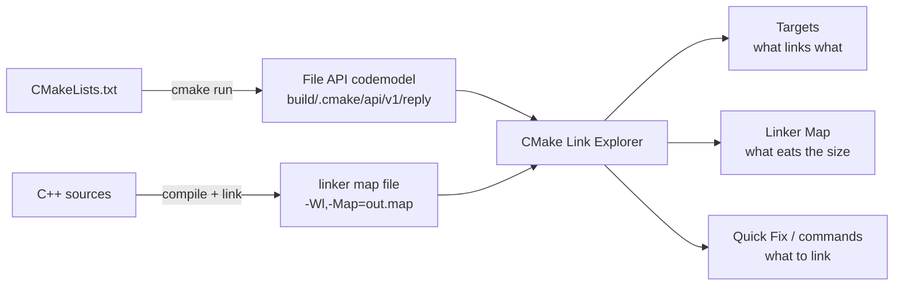
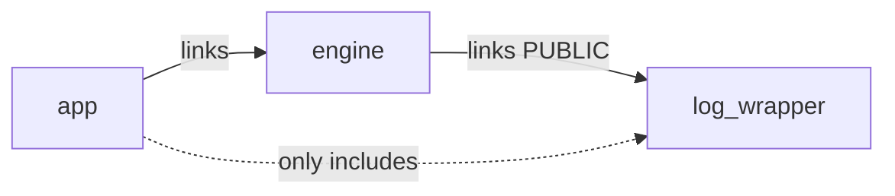
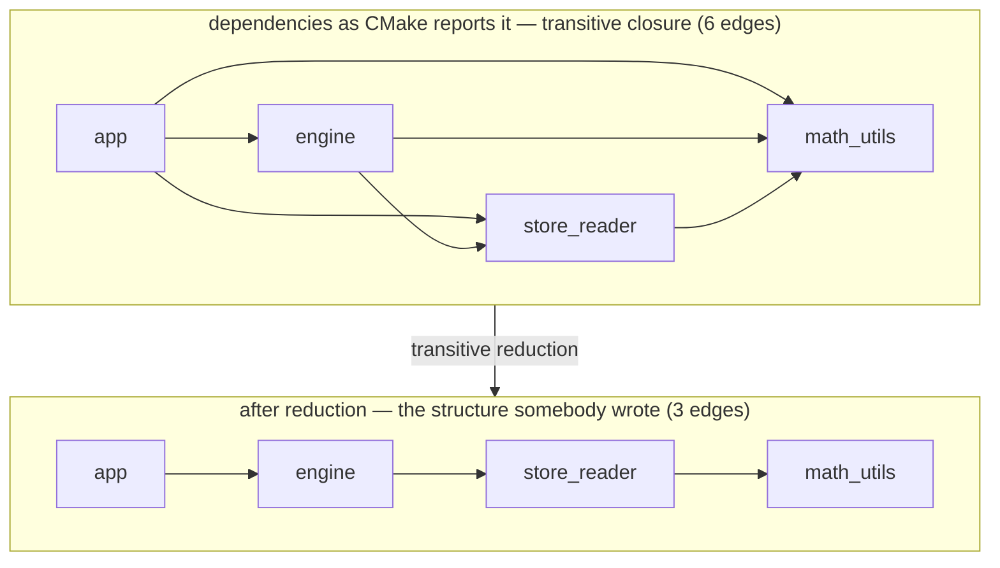
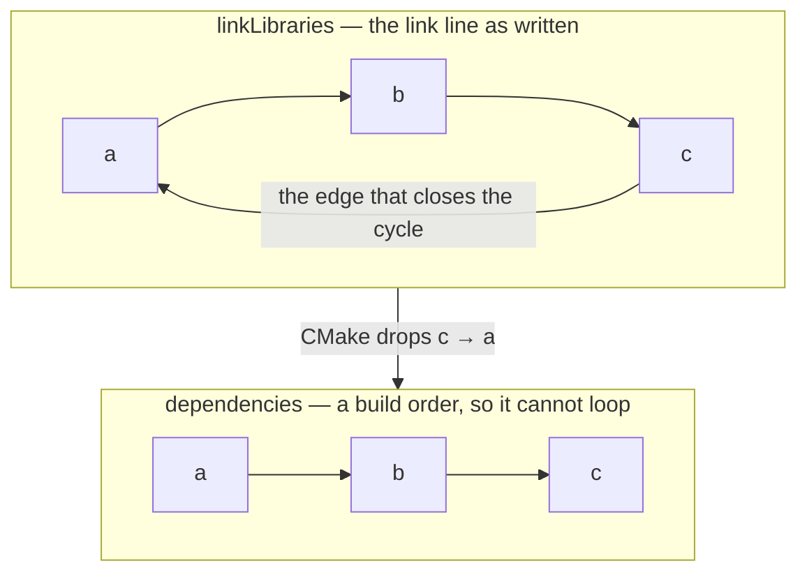

**English** · [한국어](https://github.com/Ruminem/cmake-link-explorer/blob/main/README.ko.md)

# CMake Link Explorer

A VS Code extension for the moments a CMake project stops you over linking.

| Feature | The question it answers | When you reach for it |
|---|---|---|
| **[Link for include](#link-for-include)** | **what do I have to link** to use this header | you wrote an `#include` and got stuck |
| **[Targets](#targets)** | what links what, and above all **who links this** | reading the structure, judging blast radius |
| **[Linker Map](#linker-map)** | **what is eating the size**, and what grew since the last build | the binary got bigger |
| **[Compiled With](#what-is-this-file-compiled-with)** | the **effective macros and include paths** for this file | an `#ifdef` is not firing |
| **[Cycles / Unused](#find-cycles-and-unused-targets)** | **link cycles and libraries nobody uses** | tidying the structure |
| **[Compare Trees](#compare-with-another-build-tree)** | **where two build trees diverge** | it builds here and breaks there |

## Where the answers come from

**It does not parse `CMakeLists.txt`.** It reads what CMake and the linker have
already produced, so generator expressions, conditional links and helper
functions all arrive resolved.



The codemodel carries targets, dependencies, macros, include paths and the
**`file:line` each of them was written at**. The map file carries what takes how
many bytes. Joining the two is what this extension does.

# Install

Nothing to build, no dependencies. It is plain JavaScript.

## Windows, double-click

Grab `cmake-link-explorer-<version>-windows.zip` from
[Releases](https://github.com/Ruminem/cmake-link-explorer/releases), unzip it and
run `install.cmd`. It locates VS Code itself, so **`code` does not have to be on
PATH** — right after installing VS Code the terminal is usually still holding the
PATH it started with, and `code` is not there yet.

## From a VSIX

Grab the `.vsix` from
[Releases](https://github.com/Ruminem/cmake-link-explorer/releases) and use
`...` → **Install from VSIX** in the Extensions view, or:

```
code --install-extension cmake-link-explorer-<version>.vsix
```

To build one yourself from the repository (needs Node; the extension itself
still has no dependencies):

```
npx @vscode/vsce package
```

## Cloning and linking

Easier if you intend to edit it: `git pull` and restart VS Code to pick changes up.

**macOS / Linux**

```
git clone https://github.com/Ruminem/cmake-link-explorer.git ~/cmake-link-explorer
mkdir -p ~/.vscode/extensions
ln -s ~/cmake-link-explorer ~/.vscode/extensions/cmake-link-explorer
```

**Windows** — symlinks can need elevation, so use a junction (`/J`).

```
git clone https://github.com/Ruminem/cmake-link-explorer.git C:\dev\cmake-link-explorer
mkdir "%USERPROFILE%\.vscode\extensions"
mklink /J "%USERPROFILE%\.vscode\extensions\cmake-link-explorer" "C:\dev\cmake-link-explorer"
```

## Checking it took

Quit VS Code **completely** and start it again.

```
code --list-extensions | grep cmake-link          # macOS / Linux
code --list-extensions | Select-String cmake-link # Windows PowerShell
```

`Ruminem.cmake-link-explorer` means it is installed. It sits there like a theme or
an icon pack would, and **the cloned folder does not have to be open in VS Code.**

From then on it wakes up when you open a CMake project or a C/C++ file. There is
no icon to press first.

The build directory is found by looking for `CMakeCache.txt` (three levels deep).
Map files are listed from whatever `*.map` sits in that build directory.

## Only when working on the extension itself: F5

Open this repository in VS Code and press `F5` for a window with the extension
loaded. That is the development loop; you do not need it to just use the thing.

---

# Link for include

The most frequent place to get stuck.

> "I want to include this header and use the API in it,
>  and I have no idea what to link where in CMakeLists.txt."

Put the cursor on an `#include` line and a **lightbulb (Quick Fix)** appears.

```cpp
#include "log_wrapper.h"     💡 Link log_wrapper from store_test
```

Take it and the right `CMakeLists.txt` gets edited.

```cmake
target_link_libraries(store_test PRIVATE store_reader log_wrapper)
                                                      ^^^^^^^^^^^ added
```

An existing `target_link_libraries` call is extended; if there is none, a new one
goes in right after the target is declared. Other targets in the same file are
left alone.

**An existing call is only extended when extending it is right.** A library
appended to a call that sits inside `if(WIN32)` is linked on Windows and nowhere
else, and one appended after an `INTERFACE` keyword is not linked by the target
at all — both look like the fix worked. So when the call is inside a block, or
its last section is a different keyword than the one you need, a separate call
is written instead and the notification says why. If the existing call uses the
plain signature — no keyword — CMake refuses to mix the two forms, and you are
asked to add the line by hand rather than shown an edit that would not configure.

**The keyword follows from where you included it.**

| Where the include is | Keyword | Why |
|---|---|---|
| `.cpp` | `PRIVATE` | nobody else sees it |
| `.h` / `.hpp` | `PUBLIC` | it becomes this target's interface. Consumers read that header too, so the dependency has to travel with it |
| INTERFACE library | `INTERFACE` | there is no other option |

Include from a header and link it `PRIVATE` and it **compiles here and breaks in
the consumer.** Same header: `PRIVATE` from a `.cpp`, `PUBLIC` from a `.h`.

## Four verdicts

| Verdict | Meaning |
|---|---|
| **already-linked** | linked directly. Go ahead |
| **transitive** | only reachable through another library. **It compiles today** and breaks the day that middle library stops using it |
| **needs-link** | no link at all. Here is the exact line to add |
| **not-found** | no target in this project provides it |

Calling out `transitive` separately is the whole point. It builds, so nobody
notices, until somebody else's commit breaks it.



`app` does not link `log_wrapper`. It compiles today because `engine` drags it in
`PUBLIC`. **The day somebody drops that link from `engine`, `app` breaks.** The
person who changed it has no idea what they broke, and the person holding the
breakage has no idea why.

Turning the dotted line solid is what the `transitive` verdict asks for.

## How it finds them

Header to target goes through three steps, reported in order of confidence.

1. **listed** — the header is in the target's source list (CMake knows; certain)
2. **owned** — the header is inside that target's source directory
3. **nearby** — a file by that name is somewhere under the target's directory

Which target a file belongs to comes from CMake's source lists, read backwards.

**Limit —** header-only INTERFACE libraries do not appear as targets in the CMake
codemodel, so they cannot be found. abseil's `absl::config` and friends land
here. It says `not-found` rather than inventing something.

---

# What Is This File Compiled With?

> "Why is `#ifdef USE_HAL_DRIVER` not firing?"
> "Which include paths can this file even see?"

Run the command on a source file and out come the **effective macros and include
paths**.

```
board.cpp
  target     board  [static]
  language   CXX (17)

  defines (4)   set by the build; #define in the source is not part of this
    BOARD_REV=3
    STM32F407xx
    USE_HAL_DRIVER
    NDEBUG   [from compile flags]

  include paths (2)
    /proj/board/inc
    /opt/sdk   [system]
```

**No CMakeLists spells this out.** Only `BOARD_REV=3` is defined by `board`
itself; `STM32F407xx` and `USE_HAL_DRIVER` arrived through `hal` marking them
`PUBLIC`. CMake resolves generator expressions and `PUBLIC`/`INTERFACE`
inheritance before writing the codemodel, so what shows up here is what the
compiler actually receives.

**Every `-D` counts, not just `target_compile_definitions`.** A macro put in
`CMAKE_CXX_FLAGS` or `target_compile_options()` reaches the compiler exactly as
hard, but CMake reports it as a plain command fragment rather than a define, so
it is read out of there too and marked `[from compile flags]`. MSVC's `/D` is
read as well.

**A `#define` in the source is not in this list and cannot be.** CMake never
reads the file's contents — it only knows the command line it hands the
compiler. Macros written in the file, or picked up from a header, live a layer
below anything the build system can see.

**Headers are compiled by nobody, so they are in no compile group.** When the
target has exactly one language group that is what including them means, so it is
shown and marked as inferred; when C and C++ both sit in the target, **nothing is
picked.** Choosing one would be inventing the answer.

---

# Targets

```
TARGETS                            executables first, then by how many depend on it
🚀 sample_app     →3
📦 engine         →2 ←2            a hub, without expanding anything
📦 math_utils        ←2            a leaf that links nothing
📦 db_wrap           ←1

▾ 📦 engine       →2 ←2
     → math_utils      static      blue arrow = what it links
     → store_reader    static  →1
     ← engine_test     exe         orange arrow = what links it
     ← sample_app      exe
```

One row carries both directions.

- only `→` = **top of the tree**, nothing uses it (usually an executable)
- only `←` = **a leaf library**, the dangerous kind to break
- both large = **a hub in the middle**

Expanding shows both directions at once, with no folder to go through first. Keep
expanding a child and it follows the chain in that direction only.

### Open a map and sizes appear

Open a map file in the Linker Map view and the same row gains **how much of the
binary that target occupies**.

```
🚀 sample_app     →3        111 B
📦 engine         →2 ←2      44 B
📦 store_reader   →1 ←2     1.0 KB
📦 db_wrap           ←1      277 B
📦 log_wrapper       ←1       49 B
📦 math_utils        ←2               not in this image
📚 render_core    →1 ←1     dynamic
```

The `nameOnDisk` CMake reports (`libstore_reader.a`) is matched against the names
in the map. Executables are found through CMake's rule of putting objects in
`<target>.dir/`.

Two questions then sit on one line.

- `store_reader` — **1.0 KB for something only two targets use.** A candidate for cleanup
- `math_utils` — **two targets use it and it is not in the image.** `render_core`
  is a shared library, so the symbols resolved there instead. You do not learn
  this without reading the map
- `render_core` — dynamically linked, so it is not in the image. Reporting the
  few dozen bytes of import stubs as its size would be off by orders of
  magnitude, so it just says `dynamic`

Set `sortTargets` to `size` and **"heavy for how little uses it"** sorts to the
top. That is the first move when putting a binary on a diet.

## How it works

It does not parse CMakeLists.txt. It uses CMake's **File API** (3.14+).

Drop a query file in the build directory and CMake writes **the fully resolved
target graph as JSON** into `.cmake/api/v1/reply/` on the next configure. No need
to interpret generator expressions or conditional links yourself.

### The reply is a snapshot

That reply is written **when CMake configures**, and nothing rewrites it when you
edit a `CMakeLists.txt`. Delete a `target_link_libraries()` line and the answer
to *Which Library Provides This Include?* is still "already links it" — correct
about the last configure, wrong about the file in front of you, and it looks
exactly like a right answer.

So every command compares the reply against the `CMakeLists.txt` files it was
built from, and says so before answering:

> `example/CMakeLists.txt` changed since CMake last configured, so the answer for
> this include describes the previous configure.
> **[Run CMake configure] [Show it anyway]**

The status bar carries the same warning, and the tooltip names the edited files.

A timestamp alone would fire on `Ctrl+S` over a buffer nobody changed, so when
the reply and the files agree the contents are recorded, and a file that is
newer has to differ from that record to count as an edit.

An open `CMakeLists.txt` with **unsaved** changes counts too, and no timestamp
says so — CMake reads files, not buffers. **Run CMake configure** saves those
first, and applying a link edit writes it through to disk, so the configure
offered next to it regenerates from the line just written rather than from the
text without it.

The status bar tracks this live: editing, saving or reverting a `CMakeLists.txt`
moves it without waiting for anything to reload the model.

### Transitive reduction

The File API's `dependencies` is the **transitive closure in build order**. It
lists every library an executable ends up linking, so shown as-is, a target with
three lines of `target_link_libraries` looks like it links fifty.

So it is reduced to the **minimum set of edges** that preserves reachability.



Six edges became three and **every reachable relationship survived.** There is
still a path from `app` to `math_utils`. Measured on abseil-cpp, 121 targets:

| | |
|---|---|
| edges CMake reported | 1,405 |
| after reduction | 134 (**90% fewer**) |
| the `log_flags` target | 50 → 3 |

**Careful —** the reduced graph is "the minimal shape of the link structure", not
"the list written in `target_link_libraries`".

- if A explicitly links B and C, and B also links C, the `A → C` edge disappears
- header-only INTERFACE libraries are not targets in the CMake codemodel, so they
  never show up at all (common in projects like abseil)

Turn on `showTransitiveDependencies` for the full picture. The tooltip always
carries both counts as `links: 3 (50 including transitive)`.

## Features

- `→n ←n` on the row — both counts without expanding
- sorted by **structure** by default (executables, then by how many depend on it).
  `sortTargets` switches to alphabetical
- `external` — libraries from outside the project, grouped at the bottom
- click a target to jump to the line it was declared on, read from CMake's
  `backtraceGraph`
- **Find Target** — by name
- **Why Is This Linked?** — traces the shortest dependency path between two
  targets one hop at a time, each hop carrying the `file:line` of the
  `target_link_libraries` that made it
- refreshes itself when CMake reconfigures

### The jump is not a text search

Look for a target by searching for `add_library(<name>` and you find nothing the
moment the name is a variable or the call sits inside a helper function. Both are
ordinary in real projects.

```cmake
function(add_module name)
  add_library(${name} ${name}.cpp)     # the actual add_library
endfunction()

add_module(sensor)                     # the line somebody wrote
```

Searching for `sensor` turns up nothing. CMake knows, so it is read from
`backtraceGraph` instead. **The cursor lands on the line somebody wrote**, and
when a helper stands in between, the status bar says where the `add_library`
really ran. The old text search is the fallback for a codemodel that gives no
location.

---

# Find Cycles and Unused Targets

Two things a link graph can answer about itself.

```
cycles (1)
    a → b → c → a
      a links b    libs/a/CMakeLists.txt:6
      b links c    libs/b/CMakeLists.txt:4
      c links a    libs/c/CMakeLists.txt:5

unused libraries (1)
    legacy_parser  [static]    libs/legacy_parser/CMakeLists.txt:1
```

## A cycle is not visible in `dependencies`

CMake **allows cycles between static libraries.** It resolves them by repeating
the archives on the link line, so they configure and build. That is exactly why
they go unnoticed.

The catch is that the File API's `dependencies` is a **build order**. An order
cannot loop, so CMake **drops the edge that closes the cycle**. `c` links `a` and
`c.dependencies` still comes back empty.



Look at the top only and there is a cycle; look at the bottom only and it is an
ordinary chain.

So this check reads `linkLibraries`, the link list as written. An older codemodel
has no such field, and there it says **"cannot tell" rather than "none".** You do
not get to call something absent when you cannot see it. (A project with no edges
at all is the exception: nothing can close a loop, so that answers "none".)

## What is not counted as unused

Not everything nobody links is dead weight.

| Excluded | Why |
|---|---|
| executables | they are entry points. Nothing linking them is normal |
| `install()`ed libraries | that is the deliverable, built for somebody outside |
| MODULE libraries | plugins, reached by `dlopen` rather than by linking |
| UTILITY targets | never a link target in the first place |

---

# Compare With Another Build Tree

The same `CMakeLists.txt` **configures differently on different platforms.** If
day-to-day development happens on Windows and the product is built on Linux, that
difference is usually what "builds here, breaks there" turns out to be. Put the
two build trees side by side.

```
this tree   C:/proj/out/build/x64-Debug
other tree  /mnt/linux/proj/build

only in this tree (1)
    win_shim  [static]    src/win/CMakeLists.txt:3

only in the other tree (1)
    posix_shim  [static]  src/posix/CMakeLists.txt:3

differing targets (1)
  "-" is only in this tree, "+" only in the other.

  core
    define    - USE_IOCP
    define    + USE_EPOLL
    include   - src/win
    include   + src/posix
    links     - win_shim
    links     + posix_shim
```

## Compare paths literally and everything differs

The same project has completely different path prefixes on two machines. Compare
`C:/work/proj/src` against `/home/me/proj/src` as strings and **every include
reads as changed**, which buries the signal.

So each path is taken relative to **its own tree's source root** — both of those
become `src`. Separators (`\` vs `/`) are settled too, and case is ignored: one
side is usually Windows, where CMake can record a casing the checkout does not
have.

## Deliberately not compared

| Excluded | Why |
|---|---|
| include paths outside the project | `C:/SDK/include` against `/opt/sdk/include` says where somebody installed an SDK |
| external libraries | the same dependency is `ws2_32.lib` on one side and `-lz` on the other |

Both fire on every target and drown the differences worth seeing.

---

# Linker Map

```
LINKER MAP  democore.map          gnu-ld · 21.8 KB
├── memory regions
│   ├── FLASH        3.6 KB / 512.0 KB    0.71%
│   └── RAM         18.0 KB / 128.0 KB     14.1%
├── by object                              21.8 KB total
│   ├── store_reader.o  (libdemocore.a)   17.5 KB   80.2%
│   │   ├── .bss                          16.0 KB   91.5%
│   │   └── .text                          1.5 KB    8.4%
│   └── app.o                              2.4 KB   10.8%
├── by section
├── largest symbols
└── why archive members were pulled in
    └── math_utils.o        ← app.o  (math_project)
```

## Supported formats

| | How to produce one | Status |
|---|---|---|
| **GNU ld** | `-Wl,-Map=out.map` | verified against real `arm-none-eabi-ld` output |
| **Apple ld64** | `-Wl,-map,out.map` | verified against real Xcode linker output |
| LLVM lld | `--Map=` | **unsupported** |

lld is left out on purpose. Guessing at a format without a real sample means
quietly showing wrong numbers. It goes in when there is a sample to check against.

The format is detected from the file's content. Anything that is not a map file
is rejected rather than misread.

## What the GNU ld parsing had to get right

- **wrapped section names** — GNU ld pushes the address and size onto the next
  line when the name is too long. `.text.engine_load` and everything like it
  qualifies, and missing this drops a large part of a real embedded map
- **archive members** — `libfoo.a(bar.o)` split into archive and object
- **the `Archive member included` table** — **why** each archive member was pulled
  in, and by which object referencing which symbol. The linker-level answer to
  the same question the Targets view's "Why Is This Linked?" asks
- **`Discarded input sections`** — what `--gc-sections` cut. Kept out of the image
  total but shown separately
- **memory regions** — the `Memory Configuration` table, turned into FLASH/RAM
  usage. Placement follows the address, so a `.data` whose LMA alone is in FLASH
  via `AT>` counts against RAM
- **symbols against linker script assignments** — a line like `. = ALIGN(4)` is
  not a symbol

## C++ symbol demangling

Symbols in a map file are mangled, which makes the symbol list unreadable on
exactly the C++ projects where it matters most. They go through `c++filt` in one
pass.

```
__ZNSt3__111__introsortINS_17_ClassicAlgPolicyERNS_6__lessIvEE...
  ↓
std::__1::__introsort<std::__1::_ClassicAlgPolicy, ...>(...)
```

Point `demanglerCommand` elsewhere for a different toolchain
(`arm-none-eabi-c++filt` and so on).

With no `c++filt` around, a **built-in demangler** takes over. Windows usually has
none (Git for Windows does not bundle one either) while the maps come off a Linux
build, so there it is the normal path rather than a fallback.

The built-in one handles **only the shapes worth reading**: namespaced functions,
member functions, constructors and destructors, operators, builtin types with
pointers and references, and back-references. Templates and ABI tags are
**declined on purpose and keep their mangled name.**

```
__ZN11log_wrapper3LogEPKcS1_   →  log_wrapper::Log(char const*, char const*)
__ZN4TileaSERKS_               →  Tile::operator=(Tile const&)
__ZNKSt3__110unique_ptrINS_... →  (left alone)
```

Declining costs nothing, which the checked-in maps show if you count: of 503
mangled symbols, 489 are libc++ internals whose demangled form is a
200-character template nobody reads. The 14 that get read are all inside the
subset above. Better to leave the rest mangled than to guess and quietly print a
wrong name — the same reason lld's map format is not in yet.

## Diff

**Compare Two Map Files** puts two builds side by side: what grew and shrank per
object and per section, sorted by how much it moved. Unchanged rows are left out.

```
DIFF
├── total          44.1 KB → 13.5 KB   -30.5 KB
├── by object
└── by section
    ├── __text     -28.4 KB    40.2 KB → 11.8 KB
    └── __got        -288 B       648 B → 360 B
```

---

# Settings

| Key | Default | Description |
|---|---|---|
| `cmakeLinkExplorer.buildDirectory` | `""` | Build directory. Empty means auto-detect |
| `cmakeLinkExplorer.configuration` | `""` | Which configuration to show in a multi-config generator (Debug/Release) |
| `cmakeLinkExplorer.showUtilityTargets` | `false` | Show UTILITY targets |
| `cmakeLinkExplorer.showExternalLibraries` | `true` | Show external libraries |
| `cmakeLinkExplorer.showTransitiveDependencies` | `false` | Show the full closure instead of reducing it |
| `cmakeLinkExplorer.sortTargets` | `structure` | `structure` = executables first, then by how many depend on it / `size` = by contribution to the image (needs a map) / `name` = alphabetical |
| `cmakeLinkExplorer.demangleSymbols` | `true` | Demangle C++ symbols |
| `cmakeLinkExplorer.demanglerCommand` | `c++filt` | Which demangler to use |
| `cmakeLinkExplorer.mapSymbolLimit` | `200` | Most symbols to show |

# Tests

Build the generated inputs first (`test/fixture/` and
`test/sample-project/build/` are not committed):

```
./test/bootstrap.sh
```

**Windows has no sh**, so call what it does directly. The synthetic fixture needs
only Python; the real build tree part only means anything with `cmake` installed.

```
python test\make-fixture.py
```

`python`, not `python3`. On Windows `python3` usually reaches a Microsoft Store
stub rather than an interpreter.

Then:

```
node test/run.js                                  synthetic File API fixture
node test/run.js $PWD/test/sample-project/build   a real CMake build tree
node test/run.js /path/to/any/build               any CMake project
node test/tree-test.js                            target tree rendering
node test/map-test.js                             map parser + map tree
node test/map-test.js /path/to/x.map              take one map file apart
node test/include-test.js                         include -> link resolution + CMakeLists editing
```

Inside a real VS Code extension host (activation, command registration, the tree,
editor jumps, the map view):

**macOS**

```
CMAKE_LINK_TEST_LOG=/tmp/it.log \
"/Applications/Visual Studio Code.app/Contents/MacOS/Code" \
  --user-data-dir=/tmp/clx-ud --extensions-dir=/tmp/clx-ext \
  --extensionDevelopmentPath="$PWD" \
  --extensionTestsPath="$PWD/test/integration" \
  --disable-extensions "$PWD/test/sample-project"
cat /tmp/it.log
```

**Windows (PowerShell)**

```
$env:CMAKE_LINK_TEST_LOG = "$env:TEMP\it.log"
& "$env:LOCALAPPDATA\Programs\Microsoft VS Code\Code.exe" `
  --user-data-dir="$env:TEMP\clx-ud" --extensions-dir="$env:TEMP\clx-ext" `
  --extensionDevelopmentPath="$PWD" `
  --extensionTestsPath="$PWD\test\integration" `
  --disable-extensions "$PWD\test\sample-project"
Get-Content "$env:TEMP\it.log"
```

The extension host does not hand logs back over stdout, so `CMAKE_LINK_TEST_LOG`
catches them.

Giving it a separate profile through `--user-data-dir` and `--extensions-dir`
matters. Without them, **an already-running VS Code makes it refuse with
`Running extension tests from the command line is currently only supported if no
other instance of Code is running`.** With them you keep working in your usual
window.

The map files in `test/maps/` are real linker output and are checked in, so the
tests run with no toolchain installed. Regenerate them with
`test/mapgen/generate.sh` (the GNU ld half needs
`brew install arm-none-eabi-binutils`).

## What has been verified

| Against | |
|---|---|
| synthetic File API fixture + backtraces + cycles/unused + tree comparison + staleness | 61 checks |
| `test/sample-project` (real CMake 4.4) | 18 checks |
| googletest / abseil-cpp (121 targets) | 8 checks |
| target tree rendering | 18 checks |
| map parser + map tree + target join + demangler | 64 checks |
| include → link resolution + CMakeLists editing + compile settings | 56 checks |
| VS Code extension host (1.136, macOS + Windows) | 40 checks |

# Performance

Measured on a large project (2,000 targets, 812,728 dependency edges as CMake
reported them) with an 8,000 line CMakeLists.txt.

| | Before | Now |
|---|---|---|
| `loadModel` (including transitive reduction) | 2,161 ms | **265 ms** |
| `findCommand` (a target late in the file) | 1,794 ms | **3 ms** |
| demangling 200,000 symbols | 1,014 ms | **~13 ms** |

Include resolution also went from walking directories per target to **indexing
the source tree once**. At 2,000 targets, 50 lookups of a header that is not
there went from 174 ms to 3 ms.

The main changes:

- **transitive reduction** — instead of walking the graph per dependency pair,
  word-wise OR over bitmaps of target indexes. The set CMake hands over is
  already a closure, so no graph traversal is needed at all
- **CMakeLists parsing** — "is this position inside a string" used to count from
  the start of the file every time; now it is an index of quote positions and a
  binary search. O(n²) → O(n log n)
- **demangling** — only the top symbols actually on screen, not the whole map.
  `c++filt` is a synchronous call, and handing it everything freezes the
  extension host for about a second
- **header lookup** — the source tree is indexed once and cached instead of
  walking directories per target. Rebuilt only on a miss, and only when the index
  is stale (for the write-a-header-then-include-it flow)
- **sorting** — `localeCompare` builds a collator on every call. One shared
  `Intl.Collator` took sorting 2,000 targets from 18 ms to 5 ms
- **tooltips** — built on hover through `resolveTreeItem` rather than eagerly for
  every row

# Correctness fixes

Caught while measuring.

- **path case** — Windows and the default macOS volume are case-insensitive, and
  VS Code can hand back a different casing than CMake recorded (a drive letter
  alone is enough). Compared literally, **it fails to find which target a file
  belongs to and the feature dies entirely.** On case-insensitive filesystems the
  comparison ignores case
- **symbol attribution** — symbols a linker script defines at an output section
  boundary (`_bss_start` and the like) were **attaching to an unrelated object in
  the preceding section.** Reset per output section now, so those honestly report
  that they belong to nothing
- **map size** — the file was read whole with no size check. Past V8's string
  limit a `RangeError` surfaces from deep inside the runtime. Over 256 MB it is
  refused with a reason
- **neighbour list cache key** — the cache left settings out of its key, so it
  returned stale results unless `refresh()` had been called first

# Ahead

- LLVM lld map format (when a real sample turns up)
- MSVC `link.exe /MAP` format (likewise, when a real sample turns up)
- graph view (webview with draggable nodes)

---

## Licence and trademarks

MIT. See [LICENSE](https://github.com/Ruminem/cmake-link-explorer/blob/main/LICENSE).

Not affiliated with, endorsed by, or sponsored by Kitware, Inc. **CMake** is a
trademark of Kitware, Inc., used here only to say what this extension works
with. Visual Studio Code is a product of Microsoft Corporation.
